# xmplayer
一个基于ffmpeg 4.0.3的android播放器

## 计划构造一个android studio的工程，目标是可以调试C语言代码部分。
- 运行环境：ubuntu 18.04或centos 7
- 开发工具 android studio 3.2.1
- android 环境: android-21 (也就是 android 5或以上，不考虑android 5以前的版本)
- ffmpeg下载地址：https://ffmpeg.org/releases/ffmpeg-4.0.3.tar.bz2， 在https://ffmpeg.org/releases可以看到所有的发部包下载地址。
- 基于ffplay.c构建播放器

## windows下面用vs2017编译
### 准备mingw环境
- 下载MinGW安装器，下载地址：http://www.mingw.org/ ，对应的位置 https://osdn.net/projects/mingw/releases/68260， 可能会变。
- 具体的地址：https://osdn.net/projects/mingw/downloads/68260/mingw-get-setup.exe/
- 下载完成后安装，请按下列图操作，即可。(我这里默认是发装到C:\MinGW目录）
- **注意：请不要出现中文目录，可能会有想不到的问题**

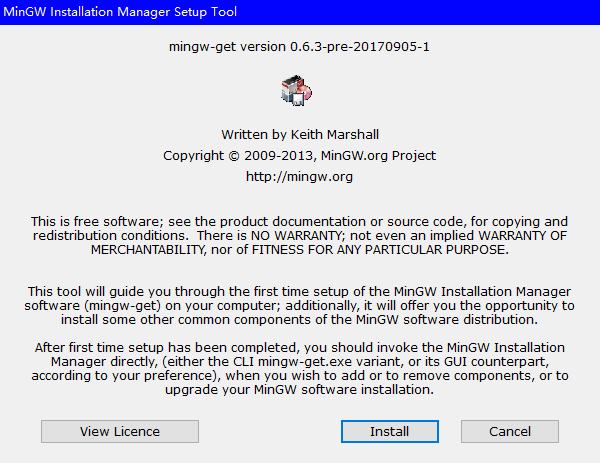

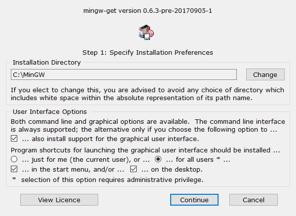

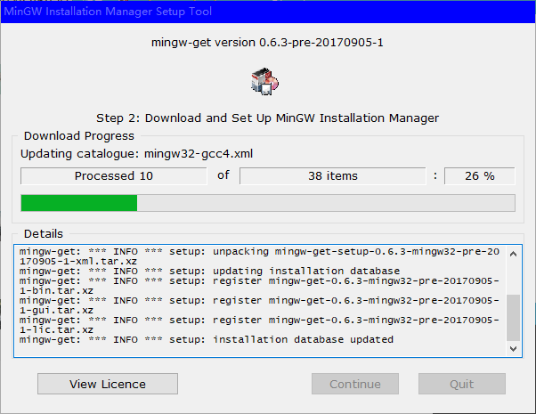

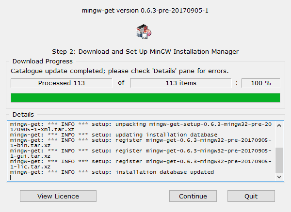

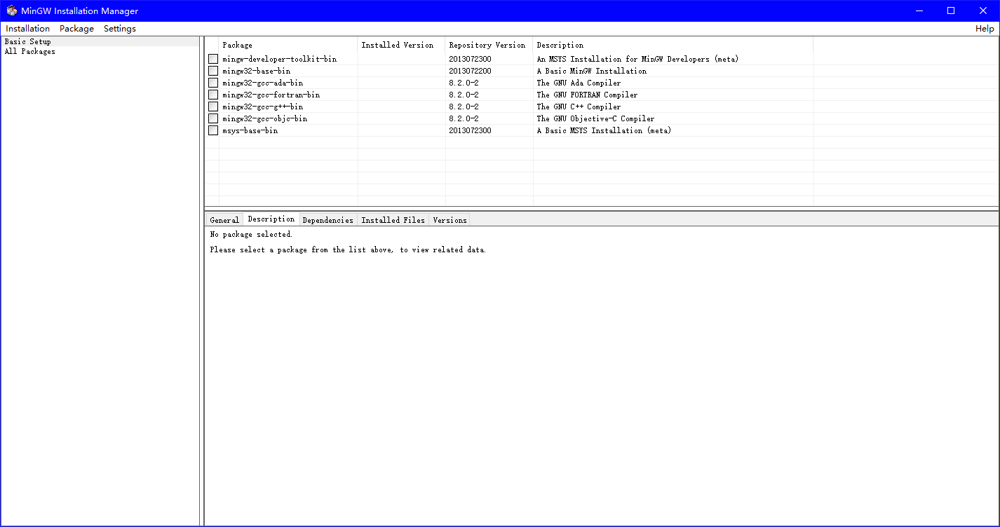

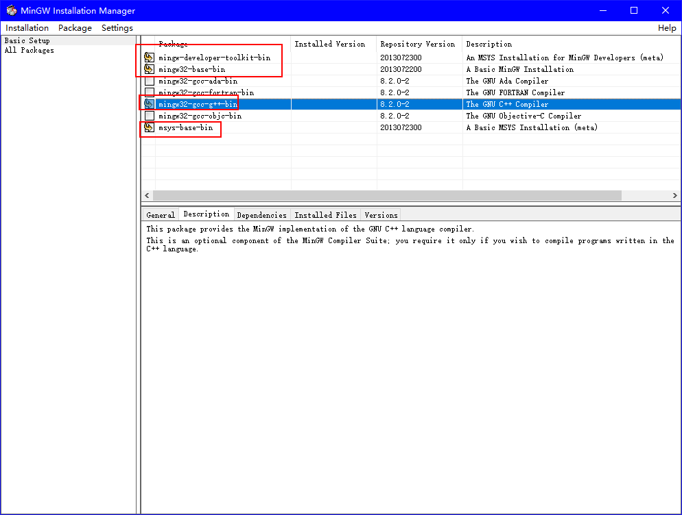

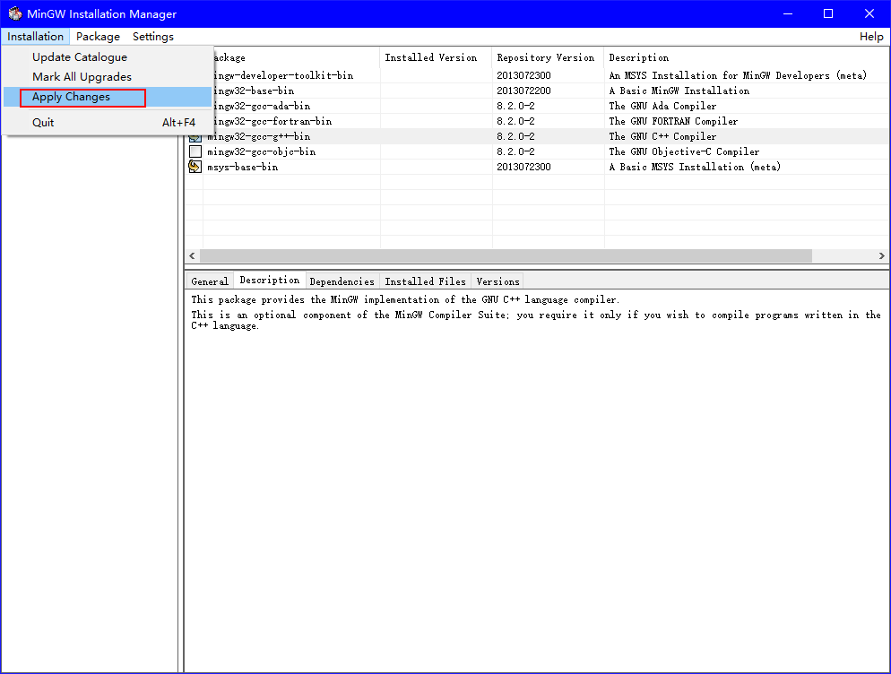

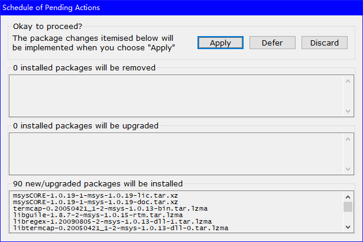

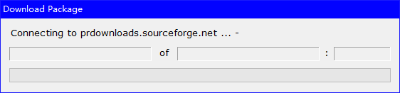

然后等它他安装完成。
### 下载yasm
- 下载yasm.exe，下载地址： http://yasm.tortall.net/ ；我这里只下载了32位版本了。
- 具体地址：http://yasm.tortall.net/Download.html

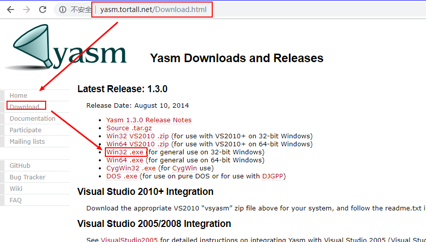

- 我这里下载的是 http://www.tortall.net/projects/yasm/releases/yasm-1.3.0-win32.exe， 下载完成后，改名为yasm.exe，并复制到**C:\MinGW\msys\1.0\bin**目录下。

- 这样就完成了MinGW的32位环境

### 安装vs2017 
- 这个网上大把文章，就不在这里说明了

### 配置运行环境的脚本

- 复制一个**C:/MinGW/msys/1.0/msys.bat**为**C:/MinGW/msys/1.0/msys_vs2017.bat**
- 编辑msys_vs2017.bat，并在第一行的@echo off的后面，增加下面一条语句（注意：这里的vs2017是默认安装的）
```bat
call "C:/program Files (x86)/Microsoft Visual Studio/2017/Enterprise/VC/Auxiliary/Build/vcvars32.bat"
```
- 完成后，如下：
```bat
@echo off
call C:/program\ Files\ (x86)/Microsoft\ Visual\ Studio/2017/Enterprise/VC/Auxiliary/Build/vcvars32.bat

rem Copyright (C):  2001, 2002, 2003, 2004, 2005  Earnie Boyd
rem   mailto:earnie@users.sf.net
rem This file is part of Minimal SYStem
rem   http://www.mingw.org/msys.shtml
rem
rem File:	    msys.bat
rem Revision:	    2.4
rem Revision Date:  December 8th, 2005
... ... 余下未修改的，略去
```
### Debug编译
- 在windows文件管理器下，双击运行msys_vs2017.bat,启动依赖环境
- 这里ffmpeg解压到c:\ffmpeg4.0.3 输入
```bash
cd c:/ffmpeg4.0.3
# 在这里可以看到configure这个文件 按照我以前的理解习惯，以为是cd /cygdrive/c/ffmpeg4.0.3 但是在这个msys则不用，用cd d:则切换到d盘，其它依赖类推

```
- 进入代码目录后，就可以用configure生成所需的头文件和makefile了
```bash
$ ./configure --enable-asm --enable-yasm --disable-avdevice --disable-doc --disable-ffplay --disable-ffprobe --disable-ffmpeg --enable-shared --disable-static --disable-bzlib --disable-libopenjpeg --disable-iconv --disable-zlib --prefix=./vs2017_build --toolchain=msvc --arch=x86 --extra-cflags="-MDd" --extra-ldflags="/NODEFAULTLIB:libcmt" --enable-debug
$ make -j4  #我这里是4核的CPU，所以用-j4，如果是双核的则-j2，八核的则-j8
$ make install
# 如果要修改配置选项，请用 ./configure --help查找编译选项
```
- 完成后，在./vs2017_build如下：

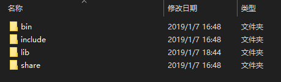

- 到这里，就完成了，所有需要的头文件和库了

## 创建vs2017的工程

### 创建工程
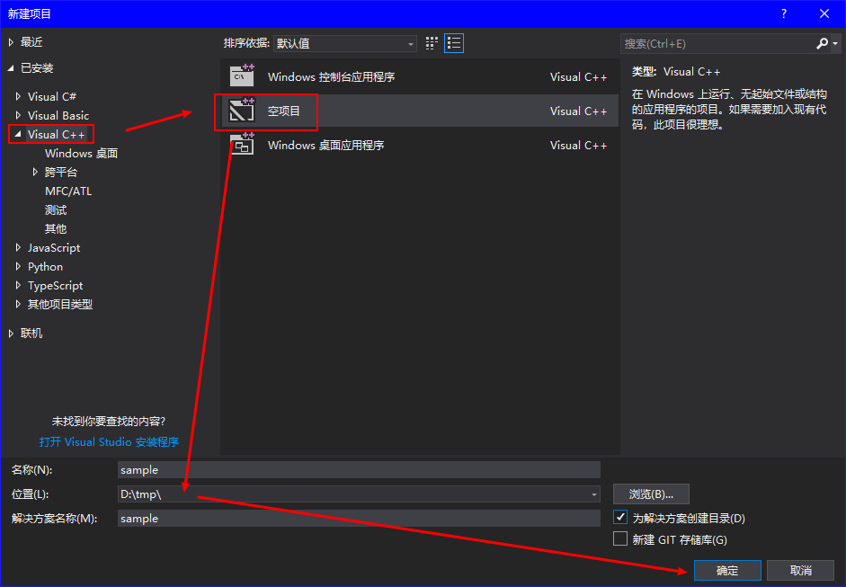

并新建一个文件main.cpp
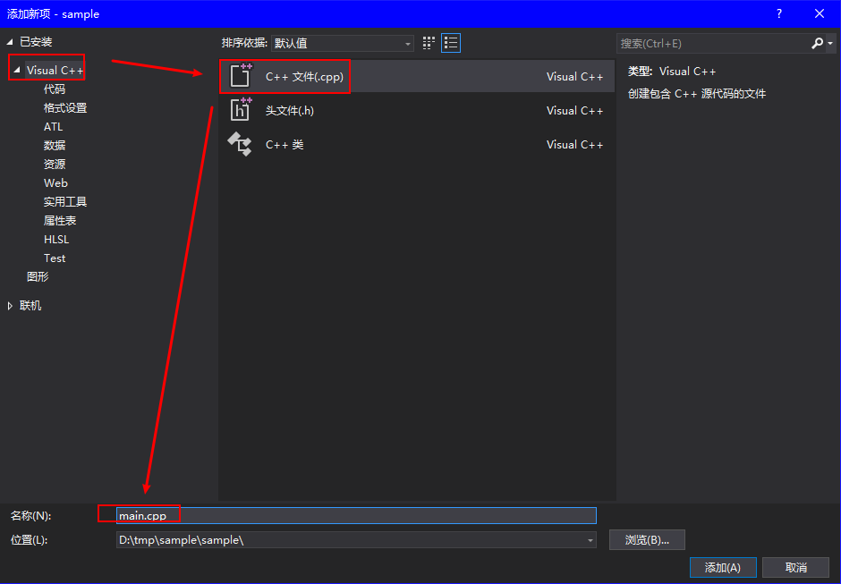

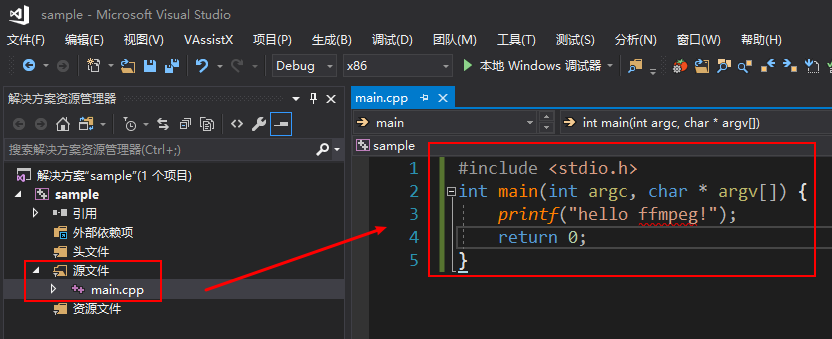
```c++
#include <stdio.h>
int main(int argc, char * argv[]) {
	printf("hello ffmpeg!");
	return 0;
}
```

### 增加依赖头文件
c:\ffmpeg-4.0.3\vs2017_build\include （视实际情况变化）
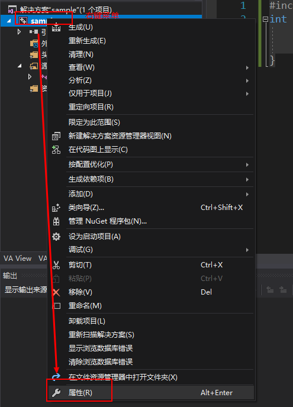
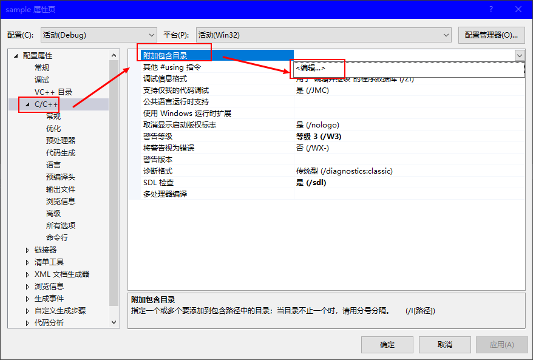
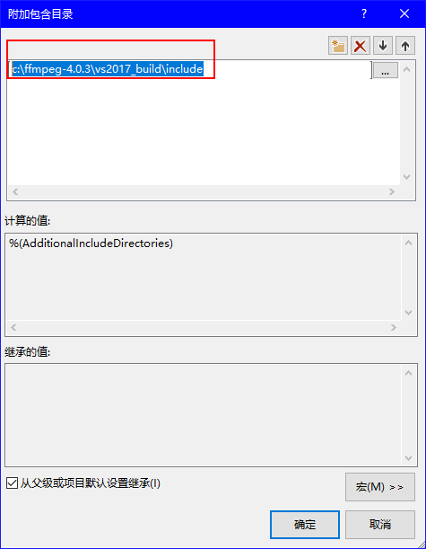

### 增加库文件目录
c:\ffmpeg-4.0.3\vs2017_build\lib（视实际情况变化）
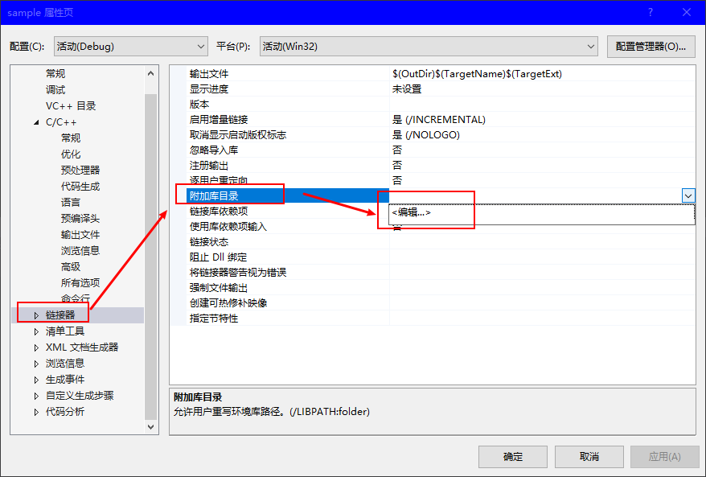
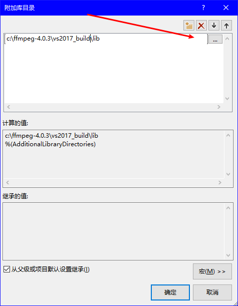

### 增加库文件
依赖的库：libavcodec.a;libavdevice.a;libavfilter.a;libavformat.a;libavutil.a;libswresample.a;libswscale.a
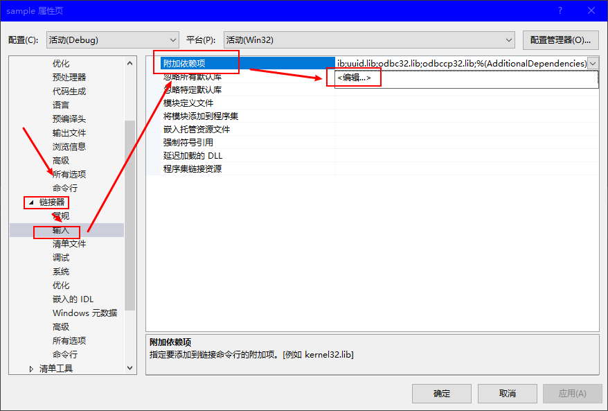
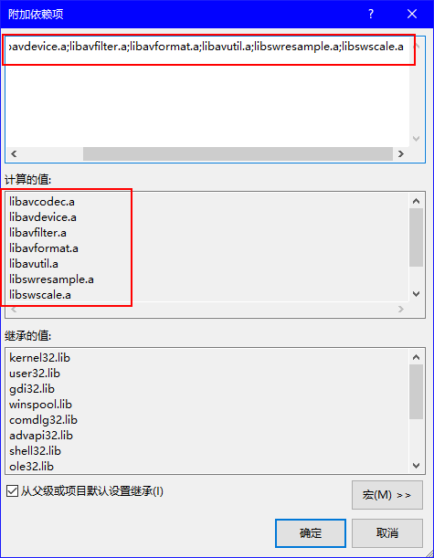


### 修改main.cpp如下
```c++
#include <stdio.h>
extern "C"
{
	#include <libavformat/avformat.h>
	#include <libavutil/dict.h>
}
int main(int argc, char * argv[]) {
	avformat_network_init();
	printf("hello ffmpeg!");
	return 0;
}
```
### LNK2019 错误
- 如下图所示，这个是缺少依赖库造成的，
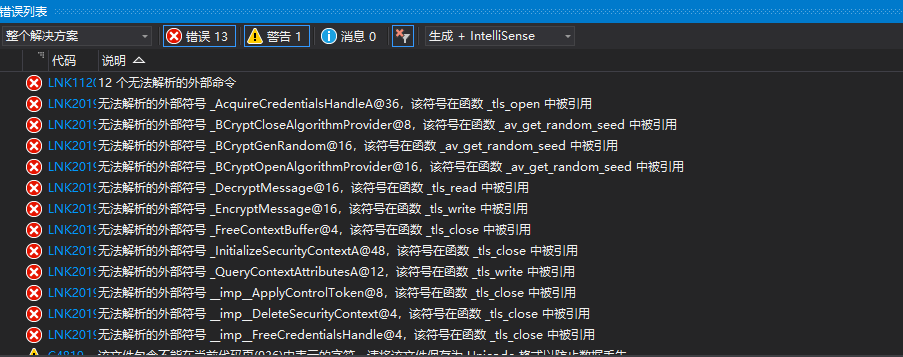
- 主要是缺少Bcrypt.lib，Ws2_32.lib，Secur32.lib这三个库
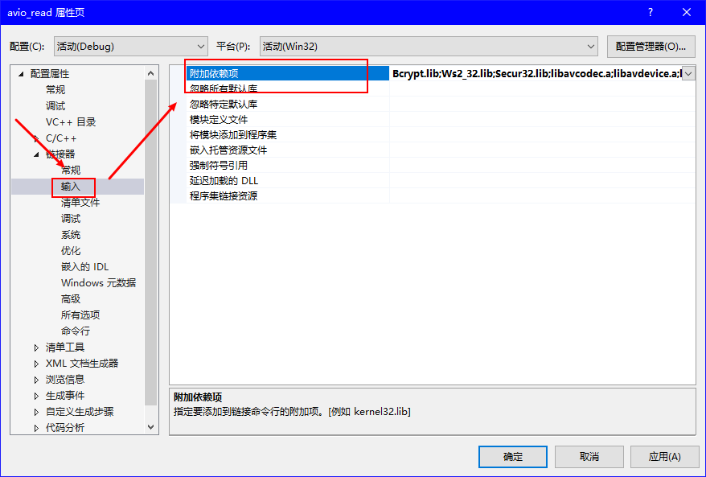
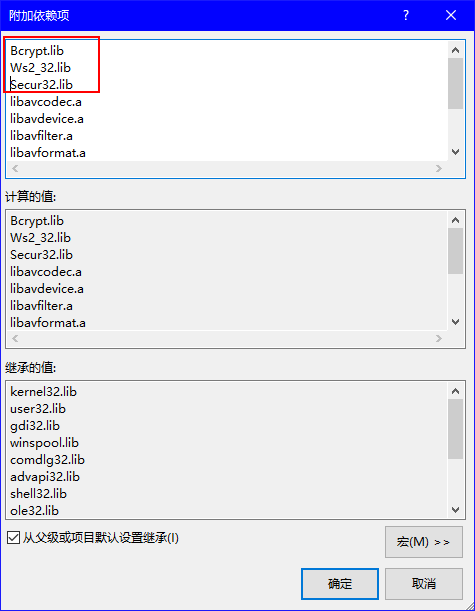

- 最后
========== 生成: 成功 1 个，失败 0 个，最新 0 个，跳过 0 个 ==========

到这里生成完后，就可以用这个版本进行调试了，并可以断点进入。

## visual studio 已经编译好的版本

在https://ffmpeg.zeranoe.com/builds/提供了windows下面所有已经编译好的库,每个发布版本都有，有需要，可以自行下载。
- windows 32位版本 https://ffmpeg.zeranoe.com/builds/win32/
- windows 64位版本 https://ffmpeg.zeranoe.com/builds/win64/

## FFMpeg 4.0的特性
更多特性说明：https://ffmpeg.org/index.html#news

April 20th, 2018, FFmpeg 4.0 "Wu"
FFmpeg 4.0 "Wu", a new major release, is now available! Some of the highlights:

- Bitstream filters for editing metadata in H.264, HEVC and MPEG-2 streams
- Experimental MagicYUV encoder
- TiVo ty/ty+ demuxer
- Intel QSV-accelerated MJPEG encoding
- native aptX and aptX HD encoder and decoder
- NVIDIA NVDEC-accelerated H.264, HEVC, MJPEG, MPEG-1/2/4, VC1, VP8/9 hwaccel decoding
- Intel QSV-accelerated overlay filter
- mcompand audio filter
- acontrast audio filter
- OpenCL overlay filter
- video mix filter
- video normalize filter
- audio lv2 wrapper filter
- VAAPI MJPEG and VP8 decoding
- AMD AMF H.264 and HEVC encoders
- video fillborders filter
- video setrange filter
- support LibreSSL (via libtls)
- Dropped support for building for Windows XP. The minimum supported Windows version is Windows Vista.
- deconvolve video filter
- entropy video filter
- hilbert audio filter source
- aiir audio filter
- Removed the ffserver program
- Removed the ffmenc and ffmdec muxer and demuxer
- VideoToolbox HEVC encoder and hwaccel
- VAAPI-accelerated ProcAmp (color balance), denoise and sharpness filters
- Add android_camera indev
- codec2 en/decoding via libcodec2
- native SBC encoder and decoder
- drmeter audio filter
- hapqa_extract bitstream filter
- filter_units bitstream filter
- AV1 Support through libaom
- E-AC-3 dependent frames support
- bitstream filter for extracting E-AC-3 core
- Haivision SRT protocol via libsrt
- vfrdet filter
- We strongly recommend users, distributors, and system integrators to upgrade unless they use current git master.
