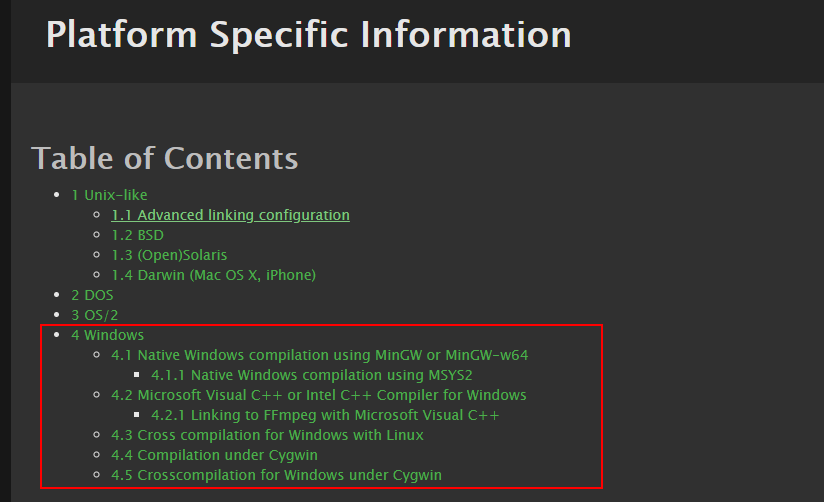

# 1. xmplayer
一个基于ffmpeg 4.0.3的android播放器

## 1.1 目录
[TOC]

## 1.2 计划构造一个android studio的工程，目标是可以调试C语言代码部分。
- 运行环境：ubuntu 18.04或centos 7
- 开发工具 android studio 3.2.1
- android 环境: android-21 (也就是 android 5或以上，不考虑android 5以前的版本)
- ffmpeg下载地址：https://ffmpeg.org/releases/ffmpeg-4.0.3.tar.bz2， 在https://ffmpeg.org/releases可以看到所有的发部包下载地址。
- 基于ffplay.c构建播放器

## 1.3 windows下面用vs2017编译
### 1.3.1 准备mingw环境

***这个是老的方式，也可以编译出所需要库，但建议使用后面的MSYS2的方式 可以编译出ffplay.exe***

- 下载MinGW安装器，下载地址：http://www.mingw.org/ ，对应的位置 https://osdn.net/projects/mingw/releases/68260， 可能会变。
- 具体的地址：https://osdn.net/projects/mingw/downloads/68260/mingw-get-setup.exe/
- 下载完成后安装，请按下列图操作，即可。(我这里默认是发装到C:\MinGW目录）
- **注意：请不要出现中文目录，可能会有想不到的问题**


然后等它他安装完成。
### 1.3.2 下载yasm
- 下载yasm.exe，下载地址： http://yasm.tortall.net/ ；我这里只下载了32位版本了。
- 具体地址：http://yasm.tortall.net/Download.html


- 我这里下载的是 http://www.tortall.net/projects/yasm/releases/yasm-1.3.0-win32.exe， 下载完成后，改名为yasm.exe，并复制到**C:\MinGW\msys\1.0\bin**目录下。

- 这样就完成了MinGW的32位环境

### 1.3.3 安装vs2017 
- 这个网上大把文章，就不在这里说明了

### 1.3.4 配置运行环境的脚本

- 复制一个**C:/MinGW/msys/1.0/msys.bat**为**C:/MinGW/msys/1.0/msys_vs2017.bat**
- 编辑msys_vs2017.bat，并在第一行的@echo off的后面，增加下面一条语句（注意：这里的vs2017是默认安装的）
```bat
call "C:/program Files (x86)/Microsoft Visual Studio/2017/Enterprise/VC/Auxiliary/Build/vcvars32.bat"
```
- 完成后，如下：
```bat
@echo off
call "C:/program Files (x86)/Microsoft Visual Studio/2017/Enterprise/VC/Auxiliary/Build/vcvars32.bat"

rem Copyright (C):  2001, 2002, 2003, 2004, 2005  Earnie Boyd
rem   mailto:earnie@users.sf.net
rem This file is part of Minimal SYStem
rem   http://www.mingw.org/msys.shtml
rem
rem File:	    msys.bat
rem Revision:	    2.4
rem Revision Date:  December 8th, 2005
... ... 余下未修改的，略去
```
### 1.3.5 Debug编译
- 在windows文件管理器下，双击运行msys_vs2017.bat,启动依赖环境
- 这里ffmpeg解压到c:\ffmpeg4.0.3 输入
```bash
cd c:/ffmpeg4.0.3
# 在这里可以看到configure这个文件 按照我以前的理解习惯，以为是cd /cygdrive/c/ffmpeg4.0.3 但是在这个msys则不用，用cd d:则切换到d盘，其它依赖类推

```
- 进入代码目录后，就可以用configure生成所需的头文件和makefile了，这里是编译生成可调试的静态库,就不生成动态库了，也不使用汇编优化了
```bash
#./configure --disable-asm --enable-avdevice --enable-doc --disable-programs --enable-avresample  --disable-shared --enable-static --disable-bzlib  --enable-gray --disable-libopenjpeg --disable-iconv --disable-zlib --prefix=./vs2017_build --toolchain=msvc --arch=x86 --extra-cflags="-MDd" --extra-ldflags="/NODEFAULTLIB:libcmt" --enable-debug
$ ./configure --disable-asm --disable-avdevice --disable-doc --disable-ffplay --disable-ffprobe --disable-ffmpeg --disable-shared --enable-static --disable-bzlib --disable-libopenjpeg --disable-iconv --disable-zlib --prefix=./vs2017_build --toolchain=msvc --arch=x86 --extra-cflags="-MDd" --extra-ldflags="/NODEFAULTLIB:libcmt" --enable-debug
$ make -j4  #我这里是4核的CPU，所以用-j4，如果是双核的则-j2，八核的则-j8
$ make install
# 如果要修改配置选项，请用 ./configure --help查找编译选项
```
- 完成后，在./vs2017_build如下：


- 到这里，就完成了，所有需要的头文件和库了


### 1.3.6 编译ffplay
- 这个请用下面的MSYS2环境编译
- 请确定安装了SDL2的包 mingw-w64-i686-SDL2
然后如下操作。
```bash
cd c:/ffmpeg4.0.3
./configure --enable-shared --prefix=./vs2017_ffplay
make -j4
make install
#这样，在c:/ffmpeg4.0.3/vs2017_ffplay/bin下，就能看到 ffplay.exe
#不过，还需要手动复制一些dll 在C:\msys2\mingw32\bin\下，将SDL2.dll和libbz2-1.dll复制到ffplay.exe同一个目录下，就可以了。
ffplay d:/work/ts/cctv2.ts 
# 就可以看到有节目播出来了
```

## 1.4 MSYS2的编译环境
- Mingw默认带的MSYS环境是1.0的版本，ffmpeg官方已经不推荐操作。 这里参考官方文档,重新定义MSYS2的编译过程。
- 1.0版本不能编译ffplay.c，这个版本可以。
- https://www.ffmpeg.org/platform.html#Windows 官方参考文档 <4 Windows>




### 1.4.1 下载MSYS2,并安装
- 下载地址：https://www.msys2.org/
- 安装，默认安装就可以了（我这里选择的是32位版本,i686）,没有什么

```bash
# Update the package database and core system packages（更新包数据库和核心包)
pacman -Syu

# normal msys2 packages
# pacman -S make pkgconf diffutils  
# 官方提供的pkgconf不存在，试出了pkg-config这个可以安装 
pacman -S make pkg-config diffutils yasm

# mingw-w64 packages and toolchains
# 下面这个是64位版本
# pacman -S mingw-w64-x86_64-nasm mingw-w64-x86_64-gcc mingw-w64-x86_64-SDL2
# 下面这个是32位版本，我这时用的是32位版本，同时这里也安装了ffplay编译，需要的SDL2
pacman -S mingw-w64-i686-nasm mingw-w64-i686-gcc mingw-w64-i686-SDL2
```

- 然后在生成编译生成一个msys_vs2017.bat的文件，在C:\msys2目录，也就是msys2_shell.cmd所在的目录
具体内容:
```bat
set MSYS2_PATH_TYPE=inherit
call "C:/program Files (x86)/Microsoft Visual Studio/2017/Enterprise/VC/Auxiliary/Build/vcvars32.bat"
msys2_shell.cmd -mingw32
```

- 将C:\msys2\usr\bin\link.exe改一下名，因为会和vc的link.exe重名

- 最后，就可以照着上面的“Debug编译”来编译了

## 1.5 创建vs2017的工程

### 1.5.1 创建工程


并新建一个文件main.cpp


```c++
#include <stdio.h>
int main(int argc, char * argv[]) {
	printf("hello ffmpeg!");
	return 0;
}
```

### 1.5.2 增加依赖头文件
c:\ffmpeg-4.0.3\vs2017_build\include （视实际情况变化）


### 1.5.3 增加库文件目录
c:\ffmpeg-4.0.3\vs2017_build\lib（视实际情况变化）


### 1.5.4 增加库文件
依赖的库：libavcodec.a;libavdevice.a;libavfilter.a;libavformat.a;libavutil.a;libswresample.a;libswscale.a


### 1.5.5 修改main.cpp如下
```c++
#include <stdio.h>
extern "C"
{
	#include <libavformat/avformat.h>
	#include <libavutil/dict.h>
}
int main(int argc, char * argv[]) {
	avformat_network_init();
	printf("hello ffmpeg!");
	return 0;
}
```
### 1.5.6 LNK2019 错误
- 如下图所示，这个是缺少依赖库造成的，

- 主要是缺少Bcrypt.lib;Ws2_32.lib;Secur32.lib这三个库


- 最后
========== 生成: 成功 1 个，失败 0 个，最新 0 个，跳过 0 个 ==========

到这里生成完后，就可以用这个版本进行调试了，并可以断点进入。

# 2. 附录

## 2.1 ./configure --help
具体的编译选项，请视实际要求调整
```bat
Usage: configure [options]
Options: [defaults in brackets after descriptions]

Help options:
  --help                   print this message
  --quiet                  Suppress showing informative output
  --list-decoders          show all available decoders
  --list-encoders          show all available encoders
  --list-hwaccels          show all available hardware accelerators
  --list-demuxers          show all available demuxers
  --list-muxers            show all available muxers
  --list-parsers           show all available parsers
  --list-protocols         show all available protocols
  --list-bsfs              show all available bitstream filters
  --list-indevs            show all available input devices
  --list-outdevs           show all available output devices
  --list-filters           show all available filters

Standard options:
  --logfile=FILE           log tests and output to FILE [ffbuild/config.log]
  --disable-logging        do not log configure debug information
  --fatal-warnings         fail if any configure warning is generated
  --prefix=PREFIX          install in PREFIX [/usr/local]
  --bindir=DIR             install binaries in DIR [PREFIX/bin]
  --datadir=DIR            install data files in DIR [PREFIX/share/ffmpeg]
  --docdir=DIR             install documentation in DIR [PREFIX/share/doc/ffmpeg]
  --libdir=DIR             install libs in DIR [PREFIX/lib]
  --shlibdir=DIR           install shared libs in DIR [LIBDIR]
  --incdir=DIR             install includes in DIR [PREFIX/include]
  --mandir=DIR             install man page in DIR [PREFIX/share/man]
  --pkgconfigdir=DIR       install pkg-config files in DIR [LIBDIR/pkgconfig]
  --enable-rpath           use rpath to allow installing libraries in paths
                           not part of the dynamic linker search path
                           use rpath when linking programs (USE WITH CARE)
  --install-name-dir=DIR   Darwin directory name for installed targets

Licensing options:
  --enable-gpl             allow use of GPL code, the resulting libs
                           and binaries will be under GPL [no]
  --enable-version3        upgrade (L)GPL to version 3 [no]
  --enable-nonfree         allow use of nonfree code, the resulting libs
                           and binaries will be unredistributable [no]

Configuration options:
  --disable-static         do not build static libraries [no]
  --enable-shared          build shared libraries [no]
  --enable-small           optimize for size instead of speed
  --disable-runtime-cpudetect disable detecting CPU capabilities at runtime (smaller binary)
  --enable-gray            enable full grayscale support (slower color)
  --disable-swscale-alpha  disable alpha channel support in swscale
  --disable-all            disable building components, libraries and programs
  --disable-autodetect     disable automatically detected external libraries [no]

Program options:
  --disable-programs       do not build command line programs
  --disable-ffmpeg         disable ffmpeg build
  --disable-ffplay         disable ffplay build
  --disable-ffprobe        disable ffprobe build

Documentation options:
  --disable-doc            do not build documentation
  --disable-htmlpages      do not build HTML documentation pages
  --disable-manpages       do not build man documentation pages
  --disable-podpages       do not build POD documentation pages
  --disable-txtpages       do not build text documentation pages

Component options:
  --disable-avdevice       disable libavdevice build
  --disable-avcodec        disable libavcodec build
  --disable-avformat       disable libavformat build
  --disable-swresample     disable libswresample build
  --disable-swscale        disable libswscale build
  --disable-postproc       disable libpostproc build
  --disable-avfilter       disable libavfilter build
  --enable-avresample      enable libavresample build (deprecated) [no]
  --disable-pthreads       disable pthreads [autodetect]
  --disable-w32threads     disable Win32 threads [autodetect]
  --disable-os2threads     disable OS/2 threads [autodetect]
  --disable-network        disable network support [no]
  --disable-dct            disable DCT code
  --disable-dwt            disable DWT code
  --disable-error-resilience disable error resilience code
  --disable-lsp            disable LSP code
  --disable-lzo            disable LZO decoder code
  --disable-mdct           disable MDCT code
  --disable-rdft           disable RDFT code
  --disable-fft            disable FFT code
  --disable-faan           disable floating point AAN (I)DCT code
  --disable-pixelutils     disable pixel utils in libavutil

Individual component options:
  --disable-everything     disable all components listed below
  --disable-encoder=NAME   disable encoder NAME
  --enable-encoder=NAME    enable encoder NAME
  --disable-encoders       disable all encoders
  --disable-decoder=NAME   disable decoder NAME
  --enable-decoder=NAME    enable decoder NAME
  --disable-decoders       disable all decoders
  --disable-hwaccel=NAME   disable hwaccel NAME
  --enable-hwaccel=NAME    enable hwaccel NAME
  --disable-hwaccels       disable all hwaccels
  --disable-muxer=NAME     disable muxer NAME
  --enable-muxer=NAME      enable muxer NAME
  --disable-muxers         disable all muxers
  --disable-demuxer=NAME   disable demuxer NAME
  --enable-demuxer=NAME    enable demuxer NAME
  --disable-demuxers       disable all demuxers
  --enable-parser=NAME     enable parser NAME
  --disable-parser=NAME    disable parser NAME
  --disable-parsers        disable all parsers
  --enable-bsf=NAME        enable bitstream filter NAME
  --disable-bsf=NAME       disable bitstream filter NAME
  --disable-bsfs           disable all bitstream filters
  --enable-protocol=NAME   enable protocol NAME
  --disable-protocol=NAME  disable protocol NAME
  --disable-protocols      disable all protocols
  --enable-indev=NAME      enable input device NAME
  --disable-indev=NAME     disable input device NAME
  --disable-indevs         disable input devices
  --enable-outdev=NAME     enable output device NAME
  --disable-outdev=NAME    disable output device NAME
  --disable-outdevs        disable output devices
  --disable-devices        disable all devices
  --enable-filter=NAME     enable filter NAME
  --disable-filter=NAME    disable filter NAME
  --disable-filters        disable all filters

External library support:

  Using any of the following switches will allow FFmpeg to link to the
  corresponding external library. All the components depending on that library
  will become enabled, if all their other dependencies are met and they are not
  explicitly disabled. E.g. --enable-libwavpack will enable linking to
  libwavpack and allow the libwavpack encoder to be built, unless it is
  specifically disabled with --disable-encoder=libwavpack.

  Note that only the system libraries are auto-detected. All the other external
  libraries must be explicitly enabled.

  Also note that the following help text describes the purpose of the libraries
  themselves, not all their features will necessarily be usable by FFmpeg.

  --disable-alsa           disable ALSA support [autodetect]
  --disable-appkit         disable Apple AppKit framework [autodetect]
  --disable-avfoundation   disable Apple AVFoundation framework [autodetect]
  --enable-avisynth        enable reading of AviSynth script files [no]
  --disable-bzlib          disable bzlib [autodetect]
  --disable-coreimage      disable Apple CoreImage framework [autodetect]
  --enable-chromaprint     enable audio fingerprinting with chromaprint [no]
  --enable-frei0r          enable frei0r video filtering [no]
  --enable-gcrypt          enable gcrypt, needed for rtmp(t)e support
                           if openssl, librtmp or gmp is not used [no]
  --enable-gmp             enable gmp, needed for rtmp(t)e support
                           if openssl or librtmp is not used [no]
  --enable-gnutls          enable gnutls, needed for https support
                           if openssl or libtls is not used [no]
  --disable-iconv          disable iconv [autodetect]
  --enable-jni             enable JNI support [no]
  --enable-ladspa          enable LADSPA audio filtering [no]
  --enable-libaom          enable AV1 video encoding/decoding via libaom [no]
  --enable-libass          enable libass subtitles rendering,
                           needed for subtitles and ass filter [no]
  --enable-libbluray       enable BluRay reading using libbluray [no]
  --enable-libbs2b         enable bs2b DSP library [no]
  --enable-libcaca         enable textual display using libcaca [no]
  --enable-libcelt         enable CELT decoding via libcelt [no]
  --enable-libcdio         enable audio CD grabbing with libcdio [no]
  --enable-libcodec2       enable codec2 en/decoding using libcodec2 [no]
  --enable-libdc1394       enable IIDC-1394 grabbing using libdc1394
                           and libraw1394 [no]
  --enable-libfdk-aac      enable AAC de/encoding via libfdk-aac [no]
  --enable-libflite        enable flite (voice synthesis) support via libflite [no]
  --enable-libfontconfig   enable libfontconfig, useful for drawtext filter [no]
  --enable-libfreetype     enable libfreetype, needed for drawtext filter [no]
  --enable-libfribidi      enable libfribidi, improves drawtext filter [no]
  --enable-libgme          enable Game Music Emu via libgme [no]
  --enable-libgsm          enable GSM de/encoding via libgsm [no]
  --enable-libiec61883     enable iec61883 via libiec61883 [no]
  --enable-libilbc         enable iLBC de/encoding via libilbc [no]
  --enable-libjack         enable JACK audio sound server [no]
  --enable-libkvazaar      enable HEVC encoding via libkvazaar [no]
  --enable-libmodplug      enable ModPlug via libmodplug [no]
  --enable-libmp3lame      enable MP3 encoding via libmp3lame [no]
  --enable-libopencore-amrnb enable AMR-NB de/encoding via libopencore-amrnb [no]
  --enable-libopencore-amrwb enable AMR-WB decoding via libopencore-amrwb [no]
  --enable-libopencv       enable video filtering via libopencv [no]
  --enable-libopenh264     enable H.264 encoding via OpenH264 [no]
  --enable-libopenjpeg     enable JPEG 2000 de/encoding via OpenJPEG [no]
  --enable-libopenmpt      enable decoding tracked files via libopenmpt [no]
  --enable-libopus         enable Opus de/encoding via libopus [no]
  --enable-libpulse        enable Pulseaudio input via libpulse [no]
  --enable-librsvg         enable SVG rasterization via librsvg [no]
  --enable-librubberband   enable rubberband needed for rubberband filter [no]
  --enable-librtmp         enable RTMP[E] support via librtmp [no]
  --enable-libshine        enable fixed-point MP3 encoding via libshine [no]
  --enable-libsmbclient    enable Samba protocol via libsmbclient [no]
  --enable-libsnappy       enable Snappy compression, needed for hap encoding [no]
  --enable-libsoxr         enable Include libsoxr resampling [no]
  --enable-libspeex        enable Speex de/encoding via libspeex [no]
  --enable-libsrt          enable Haivision SRT protocol via libsrt [no]
  --enable-libssh          enable SFTP protocol via libssh [no]
  --enable-libtesseract    enable Tesseract, needed for ocr filter [no]
  --enable-libtheora       enable Theora encoding via libtheora [no]
  --enable-libtls          enable LibreSSL (via libtls), needed for https support
                           if openssl or gnutls is not used [no]
  --enable-libtwolame      enable MP2 encoding via libtwolame [no]
  --enable-libv4l2         enable libv4l2/v4l-utils [no]
  --enable-libvidstab      enable video stabilization using vid.stab [no]
  --enable-libvmaf         enable vmaf filter via libvmaf [no]
  --enable-libvo-amrwbenc  enable AMR-WB encoding via libvo-amrwbenc [no]
  --enable-libvorbis       enable Vorbis en/decoding via libvorbis,
                           native implementation exists [no]
  --enable-libvpx          enable VP8 and VP9 de/encoding via libvpx [no]
  --enable-libwavpack      enable wavpack encoding via libwavpack [no]
  --enable-libwebp         enable WebP encoding via libwebp [no]
  --enable-libx264         enable H.264 encoding via x264 [no]
  --enable-libx265         enable HEVC encoding via x265 [no]
  --enable-libxavs         enable AVS encoding via xavs [no]
  --enable-libxcb          enable X11 grabbing using XCB [autodetect]
  --enable-libxcb-shm      enable X11 grabbing shm communication [autodetect]
  --enable-libxcb-xfixes   enable X11 grabbing mouse rendering [autodetect]
  --enable-libxcb-shape    enable X11 grabbing shape rendering [autodetect]
  --enable-libxvid         enable Xvid encoding via xvidcore,
                           native MPEG-4/Xvid encoder exists [no]
  --enable-libxml2         enable XML parsing using the C library libxml2 [no]
  --enable-libzimg         enable z.lib, needed for zscale filter [no]
  --enable-libzmq          enable message passing via libzmq [no]
  --enable-libzvbi         enable teletext support via libzvbi [no]
  --enable-lv2             enable LV2 audio filtering [no]
  --disable-lzma           disable lzma [autodetect]
  --enable-decklink        enable Blackmagic DeckLink I/O support [no]
  --enable-libndi_newtek   enable Newteck NDI I/O support [no]
  --enable-mediacodec      enable Android MediaCodec support [no]
  --enable-libmysofa       enable libmysofa, needed for sofalizer filter [no]
  --enable-openal          enable OpenAL 1.1 capture support [no]
  --enable-opencl          enable OpenCL processing [no]
  --enable-opengl          enable OpenGL rendering [no]
  --enable-openssl         enable openssl, needed for https support
                           if gnutls or libtls is not used [no]
  --disable-sndio          disable sndio support [autodetect]
  --disable-schannel       disable SChannel SSP, needed for TLS support on
                           Windows if openssl and gnutls are not used [autodetect]
  --disable-sdl2           disable sdl2 [autodetect]
  --disable-securetransport disable Secure Transport, needed for TLS support
                           on OSX if openssl and gnutls are not used [autodetect]
  --disable-xlib           disable xlib [autodetect]
  --disable-zlib           disable zlib [autodetect]

  The following libraries provide various hardware acceleration features:
  --disable-amf            disable AMF video encoding code [autodetect]
  --disable-audiotoolbox   disable Apple AudioToolbox code [autodetect]
  --enable-cuda-sdk        enable CUDA features that require the CUDA SDK [no]
  --disable-cuvid          disable Nvidia CUVID support [autodetect]
  --disable-d3d11va        disable Microsoft Direct3D 11 video acceleration code [autodetect]
  --disable-dxva2          disable Microsoft DirectX 9 video acceleration code [autodetect]
  --disable-ffnvcodec      disable dynamically linked Nvidia code [autodetect]
  --enable-libdrm          enable DRM code (Linux) [no]
  --enable-libmfx          enable Intel MediaSDK (AKA Quick Sync Video) code via libmfx [no]
  --enable-libnpp          enable Nvidia Performance Primitives-based code [no]
  --enable-mmal            enable Broadcom Multi-Media Abstraction Layer (Raspberry Pi) via MMAL [no]
  --disable-nvdec          disable Nvidia video decoding acceleration (via hwaccel) [autodetect]
  --disable-nvenc          disable Nvidia video encoding code [autodetect]
  --enable-omx             enable OpenMAX IL code [no]
  --enable-omx-rpi         enable OpenMAX IL code for Raspberry Pi [no]
  --enable-rkmpp           enable Rockchip Media Process Platform code [no]
  --disable-v4l2-m2m       disable V4L2 mem2mem code [autodetect]
  --disable-vaapi          disable Video Acceleration API (mainly Unix/Intel) code [autodetect]
  --disable-vdpau          disable Nvidia Video Decode and Presentation API for Unix code [autodetect]
  --disable-videotoolbox   disable VideoToolbox code [autodetect]

Toolchain options:
  --arch=ARCH              select architecture []
  --cpu=CPU                select the minimum required CPU (affects
                           instruction selection, may crash on older CPUs)
  --cross-prefix=PREFIX    use PREFIX for compilation tools []
  --progs-suffix=SUFFIX    program name suffix []
  --enable-cross-compile   assume a cross-compiler is used
  --sysroot=PATH           root of cross-build tree
  --sysinclude=PATH        location of cross-build system headers
  --target-os=OS           compiler targets OS []
  --target-exec=CMD        command to run executables on target
  --target-path=DIR        path to view of build directory on target
  --target-samples=DIR     path to samples directory on target
  --tempprefix=PATH        force fixed dir/prefix instead of mktemp for checks
  --toolchain=NAME         set tool defaults according to NAME
                           (gcc-asan, clang-asan, gcc-msan, clang-msan,
                           gcc-tsan, clang-tsan, gcc-usan, clang-usan,
                           valgrind-massif, valgrind-memcheck,
                           msvc, icl, gcov, llvm-cov, hardened)
  --nm=NM                  use nm tool NM [nm -g]
  --ar=AR                  use archive tool AR [ar]
  --as=AS                  use assembler AS []
  --ln_s=LN_S              use symbolic link tool LN_S [ln -s -f]
  --strip=STRIP            use strip tool STRIP [strip]
  --windres=WINDRES        use windows resource compiler WINDRES [windres]
  --x86asmexe=EXE          use nasm-compatible assembler EXE [nasm]
  --cc=CC                  use C compiler CC [gcc]
  --cxx=CXX                use C compiler CXX [g++]
  --objcc=OCC              use ObjC compiler OCC [gcc]
  --dep-cc=DEPCC           use dependency generator DEPCC [gcc]
  --nvcc=NVCC              use Nvidia CUDA compiler NVCC [nvcc]
  --ld=LD                  use linker LD []
  --pkg-config=PKGCONFIG   use pkg-config tool PKGCONFIG [pkg-config]
  --pkg-config-flags=FLAGS pass additional flags to pkgconf []
  --ranlib=RANLIB          use ranlib RANLIB [ranlib]
  --doxygen=DOXYGEN        use DOXYGEN to generate API doc [doxygen]
  --host-cc=HOSTCC         use host C compiler HOSTCC
  --host-cflags=HCFLAGS    use HCFLAGS when compiling for host
  --host-cppflags=HCPPFLAGS use HCPPFLAGS when compiling for host
  --host-ld=HOSTLD         use host linker HOSTLD
  --host-ldflags=HLDFLAGS  use HLDFLAGS when linking for host
  --host-libs=HLIBS        use libs HLIBS when linking for host
  --host-os=OS             compiler host OS []
  --extra-cflags=ECFLAGS   add ECFLAGS to CFLAGS []
  --extra-cxxflags=ECFLAGS add ECFLAGS to CXXFLAGS []
  --extra-objcflags=FLAGS  add FLAGS to OBJCFLAGS []
  --extra-ldflags=ELDFLAGS add ELDFLAGS to LDFLAGS []
  --extra-ldexeflags=ELDFLAGS add ELDFLAGS to LDEXEFLAGS []
  --extra-ldsoflags=ELDFLAGS add ELDFLAGS to LDSOFLAGS []
  --extra-libs=ELIBS       add ELIBS []
  --extra-version=STRING   version string suffix []
  --optflags=OPTFLAGS      override optimization-related compiler flags
  --nvccflags=NVCCFLAGS    override nvcc flags [-gencode arch=compute_30,code=sm_30 -O2]
  --build-suffix=SUFFIX    library name suffix []
  --enable-pic             build position-independent code
  --enable-thumb           compile for Thumb instruction set
  --enable-lto             use link-time optimization
  --env="ENV=override"     override the environment variables

Advanced options (experts only):
  --malloc-prefix=PREFIX   prefix malloc and related names with PREFIX
  --custom-allocator=NAME  use a supported custom allocator
  --disable-symver         disable symbol versioning
  --enable-hardcoded-tables use hardcoded tables instead of runtime generation
  --disable-safe-bitstream-reader
                           disable buffer boundary checking in bitreaders
                           (faster, but may crash)
  --sws-max-filter-size=N  the max filter size swscale uses [256]

Optimization options (experts only):
  --disable-asm            disable all assembly optimizations
  --disable-altivec        disable AltiVec optimizations
  --disable-vsx            disable VSX optimizations
  --disable-power8         disable POWER8 optimizations
  --disable-amd3dnow       disable 3DNow! optimizations
  --disable-amd3dnowext    disable 3DNow! extended optimizations
  --disable-mmx            disable MMX optimizations
  --disable-mmxext         disable MMXEXT optimizations
  --disable-sse            disable SSE optimizations
  --disable-sse2           disable SSE2 optimizations
  --disable-sse3           disable SSE3 optimizations
  --disable-ssse3          disable SSSE3 optimizations
  --disable-sse4           disable SSE4 optimizations
  --disable-sse42          disable SSE4.2 optimizations
  --disable-avx            disable AVX optimizations
  --disable-xop            disable XOP optimizations
  --disable-fma3           disable FMA3 optimizations
  --disable-fma4           disable FMA4 optimizations
  --disable-avx2           disable AVX2 optimizations
  --disable-avx512         disable AVX-512 optimizations
  --disable-aesni          disable AESNI optimizations
  --disable-armv5te        disable armv5te optimizations
  --disable-armv6          disable armv6 optimizations
  --disable-armv6t2        disable armv6t2 optimizations
  --disable-vfp            disable VFP optimizations
  --disable-neon           disable NEON optimizations
  --disable-inline-asm     disable use of inline assembly
  --disable-x86asm         disable use of standalone x86 assembly
  --disable-mipsdsp        disable MIPS DSP ASE R1 optimizations
  --disable-mipsdspr2      disable MIPS DSP ASE R2 optimizations
  --disable-msa            disable MSA optimizations
  --disable-mipsfpu        disable floating point MIPS optimizations
  --disable-mmi            disable Loongson SIMD optimizations
  --disable-fast-unaligned consider unaligned accesses slow

Developer options (useful when working on FFmpeg itself):
  --disable-debug          disable debugging symbols
  --enable-debug=LEVEL     set the debug level []
  --disable-optimizations  disable compiler optimizations
  --enable-extra-warnings  enable more compiler warnings
  --disable-stripping      disable stripping of executables and shared libraries
  --assert-level=level     0(default), 1 or 2, amount of assertion testing,
                           2 causes a slowdown at runtime.
  --enable-memory-poisoning fill heap uninitialized allocated space with arbitrary data
  --valgrind=VALGRIND      run "make fate" tests through valgrind to detect memory
                           leaks and errors, using the specified valgrind binary.
                           Cannot be combined with --target-exec
  --enable-ftrapv          Trap arithmetic overflows
  --samples=PATH           location of test samples for FATE, if not set use
                           $FATE_SAMPLES at make invocation time.
  --enable-neon-clobber-test check NEON registers for clobbering (should be
                           used only for debugging purposes)
  --enable-xmm-clobber-test check XMM registers for clobbering (Win64-only;
                           should be used only for debugging purposes)
  --enable-random          randomly enable/disable components
  --disable-random
  --enable-random=LIST     randomly enable/disable specific components or
  --disable-random=LIST    component groups. LIST is a comma-separated list
                           of NAME[:PROB] entries where NAME is a component
                           (group) and PROB the probability associated with
                           NAME (default 0.5).
  --random-seed=VALUE      seed value for --enable/disable-random
  --disable-valgrind-backtrace do not print a backtrace under Valgrind
                           (only applies to --disable-optimizations builds)
  --enable-osfuzz          Enable building fuzzer tool
  --libfuzzer=PATH         path to libfuzzer
  --ignore-tests=TESTS     comma-separated list (without "fate-" prefix
                           in the name) of tests whose result is ignored
  --enable-linux-perf      enable Linux Performance Monitor API

NOTE: Object files are built at the place where configure is launched.

```

## 2.2 visual studio 已经编译好的版本

在https://ffmpeg.zeranoe.com/builds/提供了windows下面所有已经编译好的库,每个发布版本都有，有需要，可以自行下载。
- windows 32位版本 https://ffmpeg.zeranoe.com/builds/win32/
- windows 64位版本 https://ffmpeg.zeranoe.com/builds/win64/

## 2.3 FFMpeg 4.0的特性
更多特性说明：https://ffmpeg.org/index.html#news

April 20th, 2018, FFmpeg 4.0 "Wu"
FFmpeg 4.0 "Wu", a new major release, is now available! Some of the highlights:

- Bitstream filters for editing metadata in H.264, HEVC and MPEG-2 streams
- Experimental MagicYUV encoder
- TiVo ty/ty+ demuxer
- Intel QSV-accelerated MJPEG encoding
- native aptX and aptX HD encoder and decoder
- NVIDIA NVDEC-accelerated H.264, HEVC, MJPEG, MPEG-1/2/4, VC1, VP8/9 hwaccel decoding
- Intel QSV-accelerated overlay filter
- mcompand audio filter
- acontrast audio filter
- OpenCL overlay filter
- video mix filter
- video normalize filter
- audio lv2 wrapper filter
- VAAPI MJPEG and VP8 decoding
- AMD AMF H.264 and HEVC encoders
- video fillborders filter
- video setrange filter
- support LibreSSL (via libtls)
- Dropped support for building for Windows XP. The minimum supported Windows version is Windows Vista.
- deconvolve video filter
- entropy video filter
- hilbert audio filter source
- aiir audio filter
- Removed the ffserver program
- Removed the ffmenc and ffmdec muxer and demuxer
- VideoToolbox HEVC encoder and hwaccel
- VAAPI-accelerated ProcAmp (color balance), denoise and sharpness filters
- Add android_camera indev
- codec2 en/decoding via libcodec2
- native SBC encoder and decoder
- drmeter audio filter
- hapqa_extract bitstream filter
- filter_units bitstream filter
- AV1 Support through libaom
- E-AC-3 dependent frames support
- bitstream filter for extracting E-AC-3 core
- Haivision SRT protocol via libsrt
- vfrdet filter
- We strongly recommend users, distributors, and system integrators to upgrade unless they use current git master.
